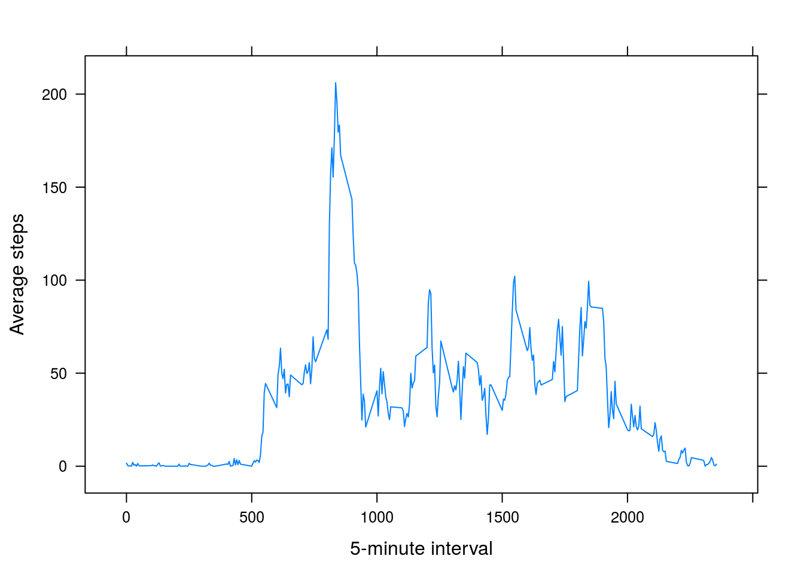
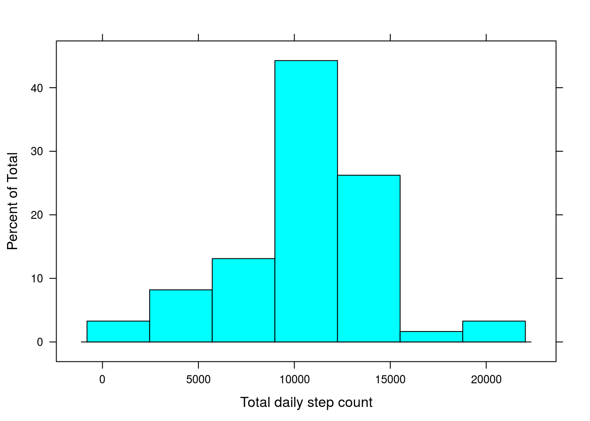

# Reproducible Research: Peer Assessment 1

## Loading and preprocessing the data
The data can be found in the "activity.zip"" file.

```r
library("ggplot2")
unzip("activity.zip")
activity = read.csv("activity.csv")
summary(activity)
```

```
##      steps                date          interval     
##  Min.   :  0.00   2012-10-01:  288   Min.   :   0.0  
##  1st Qu.:  0.00   2012-10-02:  288   1st Qu.: 588.8  
##  Median :  0.00   2012-10-03:  288   Median :1177.5  
##  Mean   : 37.38   2012-10-04:  288   Mean   :1177.5  
##  3rd Qu.: 12.00   2012-10-05:  288   3rd Qu.:1766.2  
##  Max.   :806.00   2012-10-06:  288   Max.   :2355.0  
##  NA's   :2304     (Other)   :15840
```

## What is mean total number of steps taken per day?
For this part of the assignment, we remove the NA values.

```r
steps.by.day = with(activity[!is.na(activity$steps),],aggregate(x=steps, by=list(date=date),FUN="sum"))
names(steps.by.day)[2]<-"total.steps"
```

The data histogram:

```r
qplot(steps.by.day$total.steps,xlab="Total daily step count",binwidth=2000)
```

<!-- -->


```r
mean.steps = mean(steps.by.day$total.steps)
```
The mean number of steps is 1.0766189\times 10^{4}.


```r
median.steps = median(steps.by.day$total.steps)
```

The median number of steps is 10765.

## What is the average daily activity pattern?
To analize this problem, we will contruct a plot of the average step count for each 5 minute interval.

```r
steps.by.interval = with(activity[!is.na(activity$steps),],aggregate(x=steps, by=list(interval=interval),FUN="mean"))
names(steps.by.interval)[2]<-"average.steps"
qplot(interval,average.steps,data=steps.by.interval,geom='line',xlab="5-minute interval", ylab="Average steps")
```

<!-- -->

We see that the interval 835 is the one with the highest average.

## Imputing missing values

There are 2304 NA values in the steps field of the activity dataset.

We will use the mean value for each interval to impute the missing values.


```r
filled.activity = activity

fill.na <- function(interval){
  steps.by.interval$average.steps[head(steps.by.interval$interval==interval,1)]
}

i=is.na(filled.activity$steps)
filled.activity$steps[i] <- unlist(lapply(filled.activity$interval[i],fill.na))

steps.by.day = with(filled.activity,aggregate(x=steps, by=list(date=date),FUN="sum"))
names(steps.by.day)[2]<-"total.steps"
```

The effect of this process can be seen in the histogram, where the highest bin has been increased from 16 to almost 25.

```r
qplot(steps.by.day$total.steps,xlab="Total daily step count",binwidth=2000)
```

<!-- -->


```r
mean.steps = mean(steps.by.day$total.steps)
```
The mean number of steps is 1.0766189\times 10^{4}.


```r
median.steps = median(steps.by.day$total.steps)
```

The median number of steps is 1.0766189\times 10^{4}.

The NA inputation process has affected the median, moving it towards the median.

## Are there differences in activity patterns between weekdays and weekends?


```r
filled.activity$weekday = factor(ifelse(weekdays(as.POSIXct(filled.activity$date)) %in% c("Saturday","Sunday"), "weekend","weekday"))

steps.by.interval = with(filled.activity,aggregate(x=steps, by=list(interval=interval,weekday=weekday),FUN="mean"))
names(steps.by.interval)[3]<-"average.steps"
```


```r
ggplot(steps.by.interval,aes(x=interval,y=average.steps))+labs(x="5-minute interval", y="Average steps")+facet_grid(.~weekday)+geom_line()
```

<!-- -->

